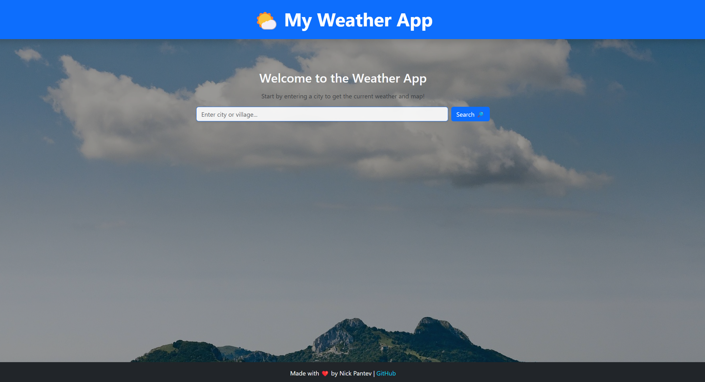
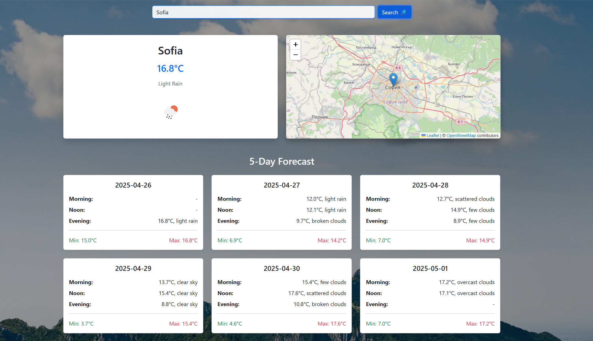

# 🌦️ React Weather App

A beautiful and responsive weather app built with **React**, **TypeScript**, **Vite**, and **Bootstrap**.  
Users can search for any city to view **current weather**, **live map preview**, and a **5-day forecast**.  
Data comes from **OpenWeather API** and **OpenStreetMap** with dynamic updates.

---

## 📸 Demo Screenshots

### 🖼️ Initial Page (before search)

> Clean landing view with search bar and beautiful mountain background.



---

### 🖼️ After Search (showing city weather + map)

> Weather details, dynamic weather icon, map preview, and 5-day forecast shown below.



---

## 🚀 Project Goals

- Practice **modern React** fundamentals (hooks, props, component architecture).
- Work with **REST APIs** using `fetch`.
- Protect sensitive data (**API keys**) with environment variables.
- Create a clean, responsive **multi-component UI**.
- Display live location maps using **Leaflet** and **OpenStreetMap**.
- Manage source control using **Git**.
- Polish styling with **Bootstrap** and a custom **background image** for a professional look.

---

## 🛠 Tech Stack

- ⚛️ React (Vite + TypeScript)
- 🎨 Bootstrap 5
- 📡 OpenWeather API (current weather + 5-day forecast)
- 🗺️ OpenStreetMap + Leaflet for map integration
- 🌄 Custom background with dimming for better readability

---

## ✨ Features

- ✅ Search and display **current weather** (temperature, condition, weather icon)
- ✅ Display **live map** for the searched city (using latitude/longitude)
- ✅ Display **5-day forecast** with morning, noon, and evening breakdowns
- ✅ Special **easter egg** if you search for `Telerik`
- ✅ Fully **responsive** layout (desktop + mobile)
- ✅ **Error handling** for wrong or unknown cities
- ✅ **Smooth visual design** with a mountain-sky background
- ✅ Link to GitHub profile in the footer
- ✅ API key protection with `.env` file
- ✅ Clean, readable and maintainable code architecture

---

## 📦 Setup Instructions

1. Clone the repo:

```bash
git clone https://github.com/IYI-Pantev/react-weather-app.git
cd react-weather-app
```

2. Install dependencies:

```bash
npm install
```

3. Create a `.env` file:

```
VITE_OPENWEATHER_API_KEY=your_api_key_here
```

4. Run the development server:

```bash
npm run dev
```

---

## 🤝 Connect with me

Made with ❤️ by [Nick Pantev](https://github.com/IYI-Pantev)

---

## 🛠 Known Issues / Future Improvements

- 🌦️ Improve 5-day forecast by grouping better by daytime
- 🖌️ Add small entry animations for cards and map (fade-in)
- 🧪 Add unit tests for API fetching
- 🚀 Deploy on Vercel or Netlify for live demo
- 📱 Improve mobile map layout (auto-zoom to better levels)

---

# 🌦️ React Weather App

A beautiful and responsive weather app built with **React**, **TypeScript**, **Vite**, and **Bootstrap**.  
Users can search for any city to view **current weather**, **live map preview**, and a **5-day forecast**.  
Data comes from **OpenWeather API** and **OpenStreetMap** with dynamic updates.

---
